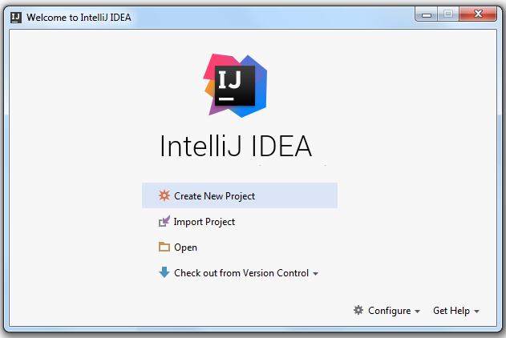
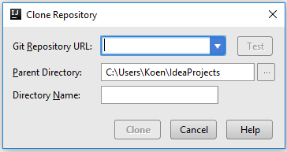
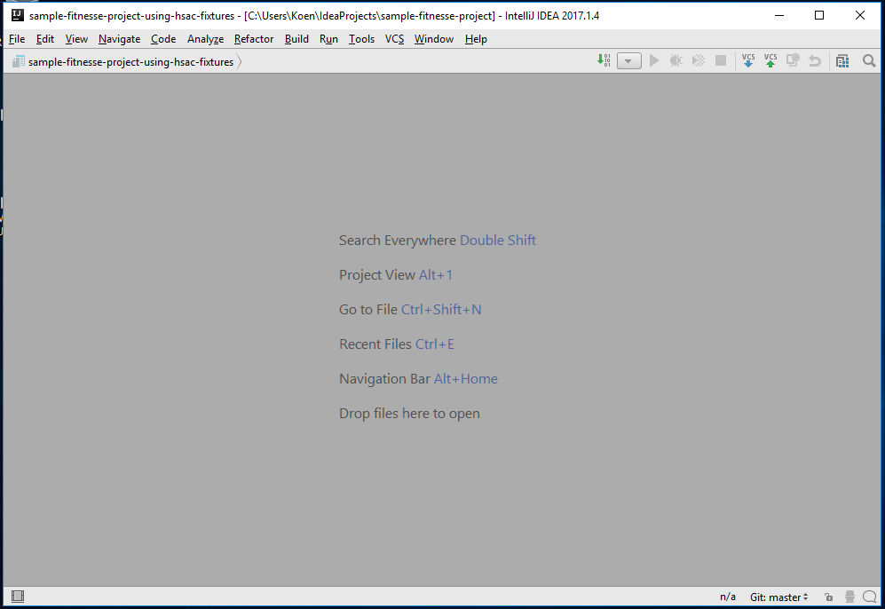
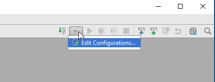
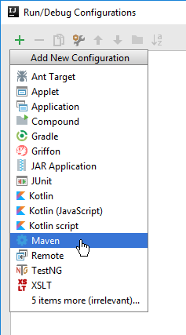
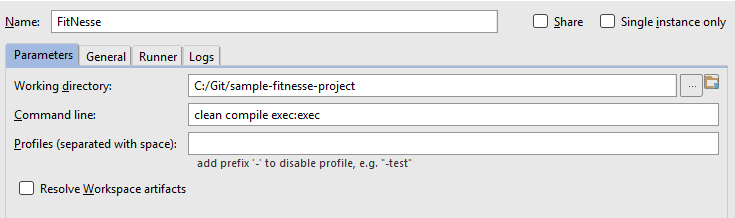
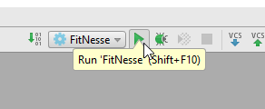
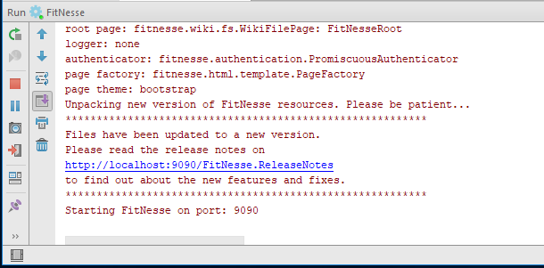

# FitNesse / HSAC installation guide

This is a step by step guide to get HSAC up and running on your machine. This guide is using Windows 10 as an OS, the steps will be similar in another environment. This guide uses IntelliJ as an Integrated Development Environment as it will allow you to get most out of FitNesse and to manage the running and updating of FitNesse as well as version control on the test files you are creating.
 
 ##Supporting tools setup
 We need to install these tools:
 * Git for version control
 * Java JDK so we can build the FitNesse framework from code
 * Intellij (including the FitNesse Plugin) to edit the test files
 
#####Git
 Go to <https://git-scm.com/downloads>, download and install Git using the default settings.
#####Java JDK
On <http://www.oracle.com/technetwork/java/javase/downloads/jdk8-downloads-2133151.html> select the correct JDK for windows, do not forget to click *Accept Licence* first. After download, install this one as well.
#####IntelliJ
Download IntelliJ from <https://www.jetbrains.com/idea/download/>, specifically choose the Community Edition. After download, install this as well using the default options.
######Chrome
While it can be assumed most people have this already, just to make you do too.
 
##FitNesse project setup
With the above tooling in place, create a folder on a local drive where the FitNesse project will be placed.

Open IntelliJ, just click Next a lot and a window should appear that will look something like this:

Select `Check out from Version Control` and choose `Git`, a window will be shown that will look a bit like this:

Fill the fields using:
* Git Repository URL: https://github.com/fhoeben/sample-fitnesse-project.git
* Parent Directory: the folder you created as the first of these steps here
* Directory name: use the default folder after you entered the git URL

Now press `Clone` and your project will be grabbed from the internet and set up in IntelliJ. A window will pop up about a pom.xml file, just click `OK` here. There might be some firewall complaints, click `Allow` if they come up.

 
Now there will be some time for the application to download and set up your project, this is normal and after all is done, it should look something like this:
 
 
We only need to set up the JDK in this project and for that go to the `File` menu, choose `Project Structure` and you will get a screen saying there is no SDK available so we will add it. For that, click `New`, choose `JDK` and browse to the JDK folder you installed earlier in this setup tutorial. If you installed using the defaults it can be found at `C:\Program Files\Java\jdk1.8_131` (although the version might differ a bit). Just select the folder and click `OK`, the JDK should be now selected in the Project Structure, so you can click `OK`.

##Build and Run FitNesse

#####Build FitNesse
Now we will build and start up FitNesse, this is the final step before we can start writing tests. For this we need to add a Run Configuration, use the button in the screenshot below and click `Edit Configurations`.

Press the `+` button to add a configuration and select `Maven`.

In the window that comes up, fill in the fields like this:
* Name: `FitNesse`
* Working Directory: fill in your project folder here and this is essential to get right
* Command line: `clean compile exec:exec`

Now press OK.

#####Run FitNesse
To run FitNesse, simply click the little green triangle next to the `Run Configuration` button:

In the bottom of the IntelliJ window, a console should come up and start doing things, FitNesse could throw a firewall warning, just accept this as some things need to be pulled from internet repositories. When it done, it should look somewhat like this:

Now use your preferred browser to navigate to <http://localhost:9090/> where your FitNesse installation is now up and running. Instructions on how to write tests can be found from the frontpage.